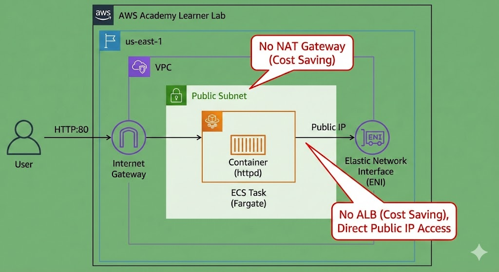

# AWS Academy Learner Lab 学習ログ: ECS Fargateによるコンテナ構築入門

**実施日:** 202X年X月X日  
**環境:** AWS Academy Learner Lab (Restricted Environment)  
**リージョン:** us-east-1 (N. Virginia)

---

## 1. 学習の目的

- AWSのマネージドコンテナサービス「**Amazon ECS**」の基本概念を理解する。
- EC2インスタンスを管理不要な「**Fargate（サーバーレス）**」起動タイプを体験する。
- Learner Labの予算（$100）を圧迫しない、コスト最適化されたネットワーク構成を構築する。

---

## 2. アーキテクチャ構成

ロードバランサー(ALB)やNAT Gatewayを使用しない、最小構成の「**パブリックサブネット配置**」を採用。

```mermaid
graph LR
    User((User)) -- HTTP:80 --> PublicIP
    subgraph VPC [VPC us-east-1]
        subgraph PublicSubnet [Public Subnet]
            PublicIP[Public IP] --> Task[ECS Task Fargate]
            Task --> Container[Container: httpd]
        end
    end
    
    %% Cost Saving Notes
    note1[No NAT Gateway<br/>(Save Cost)] -.-> PublicSubnet
    note2[No ALB<br/>(Save Cost)] -.-> Task
```

---

## 3. 使用したリソースと設定値

| リソース | 設定項目 | 設定値 / 理由 |
|----------|----------|----------------|
| Region | リージョン | us-east-1 (Learner Lab指定) |
| IAM Role | Task Role / Execution Role | LabRole (既存ロールを使用。新規作成権限がないため必須) |
| ECS | Launch Type | Fargate (EC2管理の手間を省略) |
| ECS | Image | httpd:latest (Apache公式) |
| ECS | Task CPU / Memory | .25 vCPU / .5 GB (最小サイズでコスト削減) |
| Network | VPC / Subnet | Default VPC / Public Subnet |
| Network | Auto-assign Public IP | ENABLED (重要: これがないとインターネットからイメージを取得できず、高価なNAT Gatewayが必要になる) |
| Security Group | Inbound Rules | HTTP (TCP/80) from 0.0.0.0/0 |

---

## 4. 実施手順（要約）

### 1. タスク定義 (Task Definition)

- コンテナの設計図を作成。
- IAMロールに **LabRole** を指定することに注意した。

### 2. クラスター作成

- 「Fargate」のみを選択した空のクラスターを作成。

### 3. タスク実行 (Run Task)

- サービス(Service)としてではなく、単発のタスクとして実行。
- ネットワーク設定でパブリックIPを「**有効**」に設定。

### 4. 動作確認

- 付与されたパブリックIPへブラウザからアクセスし、「It works!」を確認。

### 5. 後片付け

- タスクを停止 (Stop) し、課金を停止。

---

## 5. 学んだこと・気づき（Learner Lab特有のポイント）

### Learner Labでのハマりポイント回避

- **IAMロールの制約:** 通常のAWSチュートリアルでは「ECSタスク実行ロールを新規作成」とあるが、Learner Labでは権限エラーになる。既存の **LabRole** を流用することで解決できた。
- **ネットワークとコストの関係:** Fargateをプライベートサブネットに置くと、Docker Hubからイメージをプルするために「NAT Gateway」が必要になる。NAT Gatewayは時間単価が高いため、$100予算内での学習ではパブリックサブネット配置＋パブリックIP付与が正解だと学んだ。

### ECSの概念理解

- **タスク定義:** Docker Composeファイルのような「定義書」。
- **クラスター:** リソースの論理的な「箱」。
- **タスク:** 定義に基づいて実際に動いている「コンテナのインスタンス」。

---

## 6. 今後の課題

- 現在はIPアドレス直接指定なので、余裕があればRoute53（ただしLabでは制限あり）やALBの仕組みを学びたい。
- 今回の構成をTerraformやCloudFormationでコード化(IaC)し、構築・削除を自動化したい。


